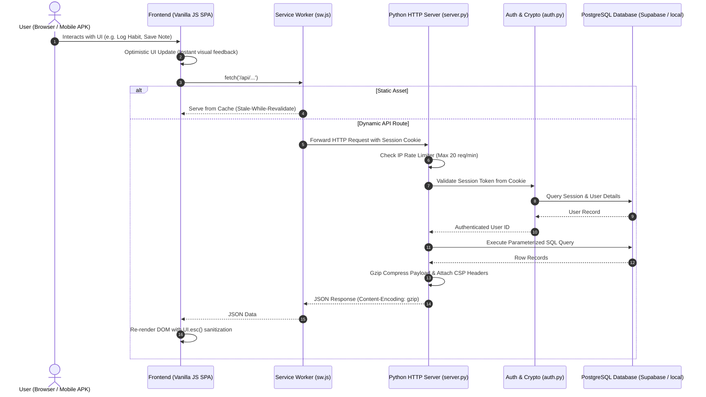

# Pocketsly: Full-Stack Architecture, Logic Blueprint & Agent Handoff Guide

> **Target Audience**: Human Developers, Students, and AI Agents (Antigravity, Claude, ChatGPT, Cursor, GitHub Copilot).
> **Purpose**: A comprehensive, self-contained architectural blueprint, operational manual, and bug-fixing protocol for the **Pocketsly** productivity suite.

---

## 📑 Table of Contents
1. [Executive Overview & Philosophy](#1-executive-overview--philosophy)
2. [Complete Project File Manifest](#2-complete-project-file-manifest)
3. [System Architecture Diagram](#3-system-architecture-diagram)
4. [Database & Persistence Engine](#4-database--persistence-engine)
5. [Backend HTTP Server & Security Middleware](#5-backend-http-server--security-middleware)
6. [Complete REST API Reference](#6-complete-rest-api-reference)
7. [Frontend Modular SPA Architecture](#7-frontend-modular-spa-architecture)
8. [CSS Design System & 3D Mechanics](#8-css-design-system--3d-mechanics)
9. [Performance, Caching & PWA Engine](#9-performance-caching--pwa-engine)
10. [Standalone Android APK Build Pipeline](#10-standalone-android-apk-build-pipeline)
11. [Automated Test Suite & Verification](#11-automated-test-suite--verification)
12. [Agent Handoff Prompt & Bug-Fixing Protocol](#12-agent-handoff-prompt--bug-fixing-protocol)
13. [Troubleshooting & Gotchas Matrix](#13-troubleshooting--gotchas-matrix)

---

## 1. Executive Overview & Philosophy

**Pocketsly** is a high-performance daily routine, academic curriculum lab, and financial productivity application built with **Pure HTML5, Vanilla CSS3, Modern JavaScript (ES6+), and Python 3 Standard Library**—with **zero external runtime dependencies or frameworks**.

### Core Engineering Principles:
1. **Minimal-Dependency Purity**: Built from fundamental web standards (HTTP protocol, DOM API, PostgreSQL engine, CSS Grid/Flexbox) plus exactly one driver (`psycopg`) so every developer and AI agent can inspect and understand exactly how every line operates.
2. **Speed & Efficiency**: Instant startup, Gzip compression, PostgreSQL indexing, and PWA Service Worker caching.
3. **Defense-in-Depth Security**: Cryptographic salting/hashing, timing-safe auth, HttpOnly cookies, sliding-window IP rate limiting, CSP, anti-clickjacking headers, and XSS sanitization.
4. **Platform Independence**: Seamlessly operates as a desktop web app, mobile responsive web app, offline-ready PWA, and standalone native Android APK.

---

## 2. Complete Project File Manifest

```
pocketsly/
├── server.py               # Custom HTTP Server, REST API Router, Gzip, Rate Limiter & CSP
├── auth.py                 # PBKDF2-HMAC-SHA256 Hashing, Sessions, OTP Password Recovery
├── db.py                   # PostgreSQL Connection Manager (psycopg) & Queries
├── schema.sql              # PostgreSQL DDL (14 Tables, 21 Performance Indexes)
├── LEARNING_GUIDE.md       # Master Architecture & Developer Learning Guide
├── README.md               # Quickstart and project introduction
│
├── static/                 # Client-Side Assets
│   ├── index.html          # Semantic HTML5 Single Page Application Layout
│   ├── manifest.json       # PWA Web App Manifest (Standalone mode, App Icons, Shortcuts)
│   ├── sw.js               # Service Worker (Offline cache, Stale-While-Revalidate)
│   │
│   ├── css/                # Modular Vanilla CSS Design System
│   │   ├── variables.css   # HSL Design Tokens, Spacing, Themes (Dark/Light)
│   │   ├── base.css        # CSS Reset, Typography, Root Scrollbar
│   │   ├── layout.css      # Desktop App Sidebar, Topbar Header, Grid Containers
│   │   ├── components.css  # Buttons, Inputs, Cards, Badges, Modals, Dropdowns
│   │   ├── dashboard.css   # KPI Bento Grid, Metric Cards, Completion Heatmap
│   │   ├── habits_tasks.css# Habit Streaks, Task Priority Pills, Checkbox States
│   │   ├── schedule.css    # Weekly Timetable Matrix (Mon-Sun 07:00-22:00)
│   │   ├── notes.css       # Note Editor, Mood Badges, Academic Library Cards
│   │   ├── curriculum.css  # GPA Simulator, SQL Console, 3D Flashcard Container
│   │   ├── budget.css      # Cash Flow Summary, Budget Bars, Transaction Tables
│   │   ├── modals.css      # Profile Settings Modal, Command Palette Spotlight
│   │   ├── responsive.css  # Mobile Breakpoints (<=768px), Bottom Navigation Bar
│   │   └── style.css       # Master CSS aggregator importing all stylesheets
│   │
│   ├── js/                 # Modular Vanilla JavaScript (Singleton Pattern)
│   │   ├── app.js          # Core App Controller, SPA Router, Theme Sync, SW Register
│   │   ├── api.js          # Standardized Async Fetch Wrapper with Credentials
│   │   ├── auth.js         # Client Auth Controller, Session Check, Login/Register UI
│   │   ├── ui.js           # Toast Notifications, Modal Dialogs, HTML Escaper (UI.esc)
│   │   ├── dashboard.js    # Metric Aggregator, KPI Cards, Today's Quick Schedule
│   │   ├── habits.js       # Habit Tracking, Optimistic Checkoffs, 7-Day Matrix
│   │   ├── tasks.js        # Priority Action Items, Filters, Due Dates
│   │   ├── schedule.js     # Timetable Grid Mapping, Class Block Positioning
│   │   ├── notes.js        # Notes Editor, Academic Library, Citation Generator
│   │   ├── curriculum.js   # GPA Simulator, SQL Playground, 25-Question 3D Quizzer
│   │   ├── budget.js       # Cash Flow Tracker, Budget Limits, CSV Export, Scanner
│   │   ├── command_palette.js # Global Spotlight (Ctrl+K), Filter Pills, Keyboard Nav
│   │   └── timer.js        # Pomodoro Focus Timer with Audio Cues & State Machine
│   │
│   └── img/                # High-Res Icons & Graphics
│       ├── pocketsly-icon-192.png  # PWA & Android Launcher Icon (192x192)
│       ├── pocketsly-icon-512.png  # High-Res Splash Icon (512x512)
│       └── favicon.ico             # Browser Tab Favicon
│
└── tests/                  # Automated Test Suites
    ├── test_api.py                 # Backend REST API Integration Tests (11 Tests)
    ├── test_perf_security.py       # Gzip, CSP, Indexes, Rate Limiter Tests
    ├── test_e2e_quiz.py            # Playwright 3D Quiz Card Flip E2E Test
    └── test_e2e_mobile_redesign.py # Mobile & Desktop UI/UX Responsive E2E Test
```

---

## 3. System Architecture Diagram



---

## 4. Database & Persistence Engine

The persistence layer uses PostgreSQL (managed by Supabase in production, or a
local Postgres for development) — a production-grade database that handles
concurrency and transaction safety natively.

### A. Connection & Row Access (`db.py`)
```python
conn = psycopg.connect(DATABASE_URL)   # Connection string from the environment
conn.row_factory = dict_row            # Rows come back as dicts: row['column_name']
# All access goes through `with db.get_db() as db:` — commits on success,
# rolls back on error, and always closes the connection.
```

### B. Relational Schema Summary (`schema.sql`)
1. **`users`**: `id`, `username`, `password_hash`, `salt`, `email`, `phone`, `security_pin`, `otp_code`, `otp_expires_at`, `currency`, `created_at`.
2. **`sessions`**: `token` (PK), `user_id` (FK), `expires_at`, `created_at`.
3. **`habits`**: `id`, `user_id` (FK), `title`, `icon`, `color`, `created_at`.
4. **`habit_logs`**: `id`, `habit_id` (FK), `log_date`, `done`, `UNIQUE(habit_id, log_date)`.
5. **`tasks`**: `id`, `user_id` (FK), `title`, `details`, `priority` (`low`/`medium`/`high`), `due_date`, `done`.
6. **`events`**: `id`, `user_id` (FK), `title`, `day_of_week` (0=Mon, 6=Sun), `start_time`, `end_time`, `location`, `color`, `course_id` (FK), `lecturer_id` (FK).
7. **`notes`**: `id`, `user_id` (FK), `title`, `body`, `mood` (`happy`/`productive`/`neutral`/`tired`/`stressed`), `created_at`, `updated_at`.
8. **`courses`**: `id`, `user_id` (FK), `code`, `name`, `credits`, `semester`, `progress`.
9. **`lecturers`**: `id`, `user_id` (FK), `name`, `email`, `office`, `phone`.
10. **`budgets`**: `id`, `user_id` (FK), `category`, `amount`, `month_year`, `UNIQUE(user_id, category, month_year)`.
11. **`expenses`**: `id`, `user_id` (FK), `category`, `amount`, `description`, `wallet`, `expense_date`.
12. **`incomes`**: `id`, `user_id` (FK), `source`, `amount`, `description`, `wallet`, `recurring`, `income_date`.
13. **`resources`**: `id`, `user_id` (FK), `title`, `author`, `resource_type`, `category`, `url_or_path`, `status`, `year`, `publisher`, `doi`, `notes`.
14. **`study_logs`**: `id`, `user_id` (FK), `course_name`, `hours`, `activity_type`, `log_date`, `notes`.

### C. Compound Performance Indexes
25 indexes ensure $O(1)$ to $O(\log N)$ query lookups:
`idx_users_username`, `idx_users_email`, `idx_sessions_token`, `idx_sessions_user_id`, `idx_habits_user`, `idx_habit_logs_date`, `idx_tasks_user`, `idx_tasks_user_done`, `idx_events_user`, `idx_events_user_day`, `idx_notes_user`, `idx_courses_user`, `idx_lecturers_user`, `idx_budgets_user`, `idx_expenses_user`, `idx_expenses_user_date`, `idx_resources_user`, `idx_study_logs_user`, `idx_study_logs_user_date`, `idx_incomes_user`, `idx_incomes_user_date`.

---

## 5. Backend HTTP Server & Security Middleware

### A. Request Lifecycle in `server.py`
1. **Routing**: `do_GET`/`do_POST`/`do_PATCH`/`do_DELETE` are thin dispatchers over route tables (`_GET_ROUTES`, `_POST_ROUTES`, `_PATCH_ROUTES`, `_DELETE_PATTERNS`). Each endpoint is a named `_get_*` / `_post_*` / `_patch_*` / `_delete_*` method; `_require_user()` centralizes session auth (401), and pattern routes pass a `re.Match` to the handler.
2. **Payload Protection**: `parse_json_body()` enforces a **10MB payload size limit**.
3. **Gzip Engine**: `_compress_if_supported()` automatically applies level 6 Gzip compression for compressible MIME types (`text/*`, `application/json`, `application/javascript`, `image/svg+xml`).
4. **Security Headers**: Attached to every response:
   - `Content-Security-Policy: default-src 'self' 'unsafe-inline' https://fonts.googleapis.com https://fonts.gstatic.com; img-src 'self' data: https: blob:; font-src 'self' https://fonts.gstatic.com data:; script-src 'self' 'unsafe-inline'; connect-src 'self';`
   - `X-Frame-Options: DENY` (Anti-Clickjacking)
   - `X-Content-Type-Options: nosniff` (Anti-MIME Sniffing)
   - `X-XSS-Protection: 1; mode=block`
   - `Referrer-Policy: strict-origin-when-cross-origin`
   - `Permissions-Policy: geolocation=(), microphone=(), camera=()`
5. **Sliding-Window IP Rate Limiter**: `_check_rate_limit()` restricts authentication and OTP endpoints (`/api/login`, `/api/register`, `/api/request-otp`, `/api/reset-password`) to **20 attempts per minute per IP**, returning `HTTP 429 Too Many Requests`.

### B. Authentication Security (`auth.py`)
- **PBKDF2-HMAC-SHA256**: 100,000 iterations + 16-byte random salt per user.
- **Constant-Time Verification**: `secrets.compare_digest(hash_a, hash_b)` to defeat timing analysis.
- **Cookie Security**: `Set-Cookie: session_id=<token>; Path=/; HttpOnly; SameSite=Lax; Max-Age=604800`.

---

## 6. Complete REST API Reference

| Endpoint | Method | Auth Req | Payload / Params | Success Response (200/201) |
|---|---|---|---|---|
| `/api/register` | `POST` | No | `{ username, password, email?, phone?, security_pin? }` | `{ success: true, user: {...} }` + Cookie |
| `/api/login` | `POST` | No | `{ username, password }` | `{ success: true, user: {...} }` + Cookie |
| `/api/logout` | `POST` | No | None | `{ success: true }` + Clear Cookie |
| `/api/session` | `GET` | No | None | `{ authenticated: bool, user: {...} }` |
| `/api/request-otp` | `POST` | No | `{ username }` or `{ email }` | `{ success: true, otp_code: "..." }` |
| `/api/reset-password` | `POST` | No | `{ username, new_password, otp_code }` | `{ success: true, message: "..." }` |
| `/api/profile` | `PATCH` | Yes | `{ email?, phone?, new_password?, otp_code? }` | `{ success: true, user: {...} }` |
| `/api/dashboard` | `GET` | Yes | None | `{ habits, tasks, schedule_today, metrics, cashflow }` |
| `/api/habits` | `GET` | Yes | None | `[ { id, title, icon, color, logs: [...] } ]` |
| `/api/habits` | `POST` | Yes | `{ title, icon, color }` | `{ id, title, ... }` |
| `/api/habits/<id>` | `DELETE` | Yes | None | `{ success: true }` |
| `/api/habits/<id>/toggle` | `POST` | Yes | `{ date: "YYYY-MM-DD" }` | `{ done: 0 \| 1 }` |
| `/api/tasks` | `GET` | Yes | None | `[ { id, title, priority, due_date, done } ]` |
| `/api/tasks` | `POST` | Yes | `{ title, details, priority, due_date }` | `{ id, title, ... }` |
| `/api/tasks/<id>/toggle` | `POST` | Yes | None | `{ done: 0 \| 1 }` |
| `/api/tasks/<id>` | `DELETE` | Yes | None | `{ success: true }` |
| `/api/events` | `GET` | Yes | None | `[ { id, title, day_of_week, start_time, end_time... } ]` |
| `/api/events` | `POST` | Yes | `{ title, day_of_week, start_time, end_time, location, color }` | `{ id, ... }` |
| `/api/events/<id>` | `DELETE` | Yes | None | `{ success: true }` |
| `/api/notes` | `GET` | Yes | None | `[ { id, title, body, mood, updated_at } ]` |
| `/api/notes` | `POST` | Yes | `{ title, body, mood }` | `{ id, title, body, mood }` |
| `/api/notes/<id>` | `PATCH` | Yes | `{ title, body, mood }` | `{ success: true }` |
| `/api/notes/<id>` | `DELETE` | Yes | None | `{ success: true }` |
| `/api/resources` | `GET` | Yes | None | `[ { id, title, author, resource_type, url_or_path, year... } ]` |
| `/api/resources` | `POST` | Yes | `{ title, author, resource_type, category, url_or_path, year, publisher, doi }` | `{ id, ... }` |
| `/api/resources/<id>` | `DELETE` | Yes | None | `{ success: true }` |
| `/api/budgets` | `GET` | Yes | `?month=YYYY-MM` | `[ { id, category, amount, month_year } ]` |
| `/api/budgets` | `POST` | Yes | `{ category, amount, month_year }` | `{ id, ... }` |
| `/api/expenses` | `GET` | Yes | None | `[ { id, category, amount, description, expense_date } ]` |
| `/api/expenses` | `POST` | Yes | `{ category, amount, description, expense_date }` | `{ id, ... }` |
| `/api/expenses/<id>` | `DELETE` | Yes | None | `{ success: true }` |
| `/api/incomes` | `GET` | Yes | None | `[ { id, source, amount, description, income_date } ]` |
| `/api/incomes` | `POST` | Yes | `{ source, amount, description, income_date }` | `{ id, ... }` |
| `/api/incomes/<id>` | `DELETE` | Yes | None | `{ success: true }` |
| `/api/backup/export` | `GET` | Yes | None | Complete atomic JSON export payload |
| `/api/backup/restore` | `POST` | Yes | `{ data: { habits, tasks, notes, ... } }` | `{ success: true }` |

---

## 7. Frontend Modular SPA Architecture

### A. Application Lifecycle
1. `index.html` loads all modular scripts (`ui.js`, `api.js`, `auth.js`, feature scripts, `app.js`).
2. `DOMContentLoaded` fires `App.init()`, initializing the active view from the URL hash (defaulting to `dashboard`), checking session status via `/api/session`, and registering the Service Worker.
3. `App.navigateTo(viewName)` switches active containers by toggling `.hidden` on `.view-container` sections and calling `<Module>.load()`.

### B. Module Registry & Global Scope
Every module is attached to `window.<ModuleName>` to allow cross-module calls and inline event handlers:
- `window.App`: Router, theme synchronization, modal coordinator.
- `window.API`: Fetch client.
- `window.UI`: Toast notifications (`UI.toast(msg, type)`), modal openers, string escaping (`UI.esc()`).
- `window.Auth`: Auth form management, OTP reset workflow.
- `window.Dashboard`, `window.Habits`, `window.Tasks`, `window.Schedule`, `window.Notes`, `window.Curriculum`, `window.Budget`, `window.CommandPalette`, `window.Timer`.

---

## 8. CSS Design System & 3D Mechanics

### A. Theme Architecture (`variables.css`)
- Colors are defined as CSS variables under `:root` and overridden under `[data-theme="dark"]`.
- Example tokens: `--bg-primary`, `--bg-surface`, `--bg-surface-alt`, `--border-color`, `--text-primary`, `--text-secondary`, `--primary`, `--success`, `--danger`, `--warning`.

### B. 3D Card Flip Implementation
To implement hardware-accelerated 3D flashcards without glitching or z-fighting:
```css
.quiz-card-wrapper {
  perspective: 1000px;
  -webkit-perspective: 1000px;
}
.quiz-card-3d {
  position: relative;
  width: 100%;
  height: 420px;
  transform-style: preserve-3d;
  -webkit-transform-style: preserve-3d;
  transition: transform 0.6s cubic-bezier(0.4, 0, 0.2, 1);
}
.quiz-card-front, .quiz-card-back {
  position: absolute;
  top: 0; left: 0; width: 100%; height: 100%;
  backface-visibility: hidden;
  -webkit-backface-visibility: hidden;
  border-radius: var(--radius-xl);
}
.quiz-card-front {
  transform: rotateY(0deg) translateZ(1px);
}
.quiz-card-back {
  transform: rotateY(180deg) translateZ(1px);
}
.quiz-card-3d.flipped {
  transform: rotateY(180deg);
}
```

---

## 9. Performance, Caching & PWA Engine

1. **Service Worker (`static/sw.js`)**:
   - Pre-caches core application shell on install (`CACHE_NAME = 'pocketsly-cache-v2.0'`).
   - Employs **Stale-While-Revalidate** for static assets (`.css`, `.js`, `.png`, fonts).
   - Employs **Network-First** for dynamic `/api/` calls.
2. **Web App Manifest (`static/manifest.json`)**:
   - `display: standalone` for an app-like experience without browser chrome.
   - Declares high-resolution icons (192px and 512px) and native app shortcuts.
3. **Typography Optimization**:
   - `<link rel="preconnect" href="https://fonts.googleapis.com">`
   - `<link rel="preconnect" href="https://fonts.gstatic.com" crossorigin>`
4. **Input Debouncing**:
   - Search inputs in `notes.js` and `command_palette.js` debounce input events by 60–120ms to prevent expensive DOM layout thrashing.

---

## 10. Automated Test Suite & Verification

Run these automated test suites before and after making code changes:

```bash
# 1. Performance, Compression & Security Suite
python3 tests/test_perf_security.py

# 2. REST API Integration Suite
pytest tests/test_api.py

# 3. 3D Quiz Card Flip E2E Suite (Playwright)
pytest tests/test_e2e_quiz.py

# 4. Mobile & Desktop UI/UX Responsive Suite (Playwright)
python3 tests/test_e2e_mobile_redesign.py
```

---

## 11. Agent Handoff Prompt & Bug-Fixing Protocol

> 📋 **Instructions for Another AI Agent**:
> When you receive a task on this repository, paste or follow this protocol to ensure consistency, zero regressions, and full architectural compliance.

```markdown
### AGENT OPERATING PROTOCOL FOR POCKETSLY

You are working on Pocketsly, a zero-dependency full-stack application.
Before making any changes:
1. Review `LEARNING_GUIDE.md` for architecture and file responsibilities.
2. Maintain Zero-Dependency Purity: Do NOT install external Python or JS frameworks.
3. Follow the Database Guidelines:
   - Always use parameterized queries `db.execute(sql, (param,))` to prevent SQL injection.
   - Always run queries through `with db.get_db() as conn:`.
4. Follow the Frontend Guidelines:
   - Always sanitize dynamic HTML strings with `UI.esc(text)`.
   - Attach all singleton modules to `window.<ModuleName>`.
   - Do NOT break the Single Page Application (SPA) routing in `app.js`.
5. Follow the Mobile & Styling Guidelines:
   - In `static/css/responsive.css`, always ensure mobile containers use explicit `gap` and `padding` to prevent card collisions.
   - All interactive touch targets must be at least 44x44px.
6. Verification:
   - Run `python3 tests/test_perf_security.py`
   - Run `pytest tests/test_api.py`
```

---

## 12. Troubleshooting & Gotchas Matrix

| Symptom | Root Cause | Exact Fix |
|---|---|---|
| **`HTTP 401 Unauthorized` on API call** | Session cookie expired, cleared, or missing. | Re-authenticate at `/api/login` or check `session_id` in browser cookies (`auth.py`). |
| **`HTTP 429 Too Many Requests`** | IP exceeded 20 requests/minute on sensitive auth routes. | Wait 60s or adjust `RATE_LIMIT_MAX_ATTEMPTS` in `server.py`. |
| **PostgreSQL not reachable** | No database answers at `DATABASE_URL` / `TEST_DATABASE_URL`. | Start a local Postgres, or point the env vars at your Supabase database. |
| **CSS or JS changes do not update in browser** | Service Worker or browser HTTP cache serving stale files. | Bump version string (`?v=7.0`) in `index.html` and update `CACHE_NAME` in `sw.js`. |
| **Card elements colliding with 0px spacing on mobile** | Container missing flex gap or grid row gap rule. | In `responsive.css`, add `display: flex !important; flex-direction: column !important; gap: 1rem !important;`. |
| **Inline `onclick="MyModule.doSomething()"` fails** | Module is not assigned to global `window` scope. | Add `window.MyModule = MyModule;` at the end of the module file. |
| **Input fields lag during rapid typing** | Search filtering running synchronously on every keystroke. | Add a debounce timer (60–120ms) before invoking the filter/render function. |
