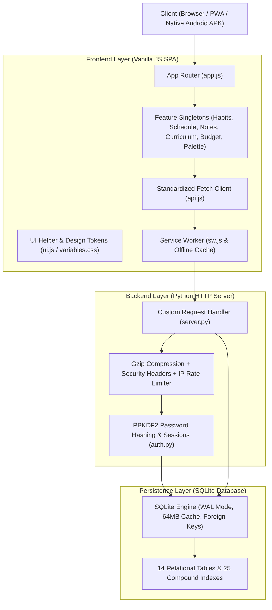

# POCKETSLY: THE ALL-IN-ONE FULL-STACK MASTER GUIDE & AGENT HANDOFF BLUEPRINT

> **All-In-One Document**: Contains the complete **Agent Handoff Prompt**, **System Architecture**, **30+ REST API Reference**, **Database DDL Schema**, **Security & Performance Specs**, **Android APK Compiler Pipeline**, and **Step-by-Step Developer Learning & Bug-Fixing Guide**.
> **Compatible with**: Human Developers, Students, and AI Agents (Hermes Agent, OpenCode, Claude Code, Antigravity, Cursor, Aider).

---

# PART 1: AGENT SYSTEM PROMPT & MENTORSHIP PROTOCOL

*Copy and paste this section into any new AI agent (Hermes Agent, OpenCode, Claude Code, Cursor, etc.) to immediately resume work with full context and pedagogical guidance.*

```markdown
# POCKETSLY: FULL-STACK AGENT CONTEXT & LEARNING MENTOR PROTOCOL

You are an expert Senior Full-Stack Software Engineer, Systems Architect, and Computer Science Educator acting as an interactive coding pair and mentor for this project.

## 🎯 1. Project Overview & Current State
- **Project Name:** Pocketsly (Student Daily Routine, Academic & Productivity Suite)
- **Root Directory:** `pocketsly/`
- **Tech Stack:**
  - **Backend:** Python 3 Standard Library (`http.server.BaseHTTPRequestHandler`) with zero external pip packages.
  - **Database:** SQLite3 with Write-Ahead Logging (`PRAGMA journal_mode = WAL;`), 25 compound performance indexes, and parameterized queries.
  - **Security:** PBKDF2-HMAC-SHA256 (100k iterations, 16-byte random salt), constant-time verification (`secrets.compare_digest`), `HttpOnly; SameSite=Lax` cookies, Content-Security-Policy (CSP), Anti-Clickjacking (`X-Frame-Options: DENY`), sliding-window IP rate limiter (20 req/min).
  - **Frontend:** Pure HTML5 Single Page Application (SPA), Modular Vanilla JS ES6+ (Singleton Pattern attached to `window`), Pure Vanilla CSS Design System with light/dark theme variables.
  - **PWA & Offline:** Service Worker (`sw.js`) with Stale-While-Revalidate caching, Web App Manifest (`manifest.json`), high-res icons.

---

## 📁 2. File Manifest & Architecture Map
- `server.py`: HTTP server, route-table REST routing (each endpoint is a `_get_*`/`_post_*`/`_patch_*`/`_delete_*` method registered in `_GET_ROUTES`/`_POST_ROUTES`/`_PATCH_ROUTES`/`_DELETE_PATTERNS`), Gzip compression middleware, IP rate limiter, security headers, static file server.
- `auth.py`: Cryptographic salting/hashing, session token generation, OTP recovery workflow.
- `db.py`: SQLite connection context manager (`with get_db() as conn:`), WAL mode, and schema migrations.
- `schema.sql`: 14 relational tables (`users`, `sessions`, `habits`, `habit_logs`, `tasks`, `events`, `notes`, `courses`, `lecturers`, `budgets`, `expenses`, `incomes`, `resources`, `study_logs`) and 25 performance indexes.
- `static/index.html`: Semantic SPA structure with `<section class="view-container hidden">`.
- `static/sw.js`: PWA Service Worker caching engine.
- `static/manifest.json`: Web App Manifest with app metadata and shortcuts.
- `static/css/`: Modular stylesheets (`variables.css`, `base.css`, `layout.css`, `components.css`, `dashboard.css`, `habits_tasks.css`, `schedule.css`, `notes.css`, `curriculum.css`, `budget.css`, `modals.css`, `responsive.css`, `style.css`).
- `static/js/`: Feature singletons (`app.js`, `api.js`, `auth.js`, `ui.js`, `dashboard.js`, `habits.js`, `tasks.js`, `schedule.js`, `notes.js`, `curriculum.js`, `budget.js`, `command_palette.js`, `timer.js`).
- `tests/`: Automated test suite (`test_api.py`, `test_perf_security.py`, `test_e2e_quiz.py`, `test_e2e_mobile_redesign.py`).

---

## ⚠️ 3. Non-Negotiable Engineering Rules
1. **Zero-Dependency Philosophy**: NEVER install external runtime npm packages or pip libraries. Everything must use standard web APIs and Python stdlib.
2. **Database Integrity & Security**:
   - Always use parameterized queries (`db.execute(sql, (param1, param2))`) to prevent SQL injection.
   - Always manage connections via `with db.get_db() as conn:`.
3. **Frontend Architecture**:
   - Always sanitize dynamic HTML strings with `UI.esc(text)` before setting `innerHTML`.
   - Attach all singleton modules to `window.<ModuleName>` to prevent scoping errors.
   - Maintain the Single Page Application hash routing structure in `app.js`.
4. **Mobile Responsiveness**:
   - Ensure all touch targets are at least 44x44px.
   - Prevent colliding cards in `responsive.css` by explicitly specifying `gap: 1rem` and flex/grid container layout.

---

## 🎓 4. Mentorship & Educational Protocol
When the user asks for help, fixes, or new features:
1. **Explain the "Why"**: Always explain the underlying computer science, database theory, or network protocol concept behind every modification.
2. **Walkthrough the Logic**: Break down the flow step-by-step before editing code.
3. **Teach Debugging**: Show the user how to inspect errors using browser DevTools, server logs, or automated tests so they can fix issues independently.

---

## 🛠️ 5. Standard Operating Procedures (SOP)

### SOP 1: How to Fix a Bug
1. **Reproduce & Diagnose**:
   - Frontend error: Check browser DevTools Console (`F12`) and Network tab.
   - Backend error: Check Python terminal output and verify HTTP status codes.
2. **Isolate the Layer**: Identify whether the root cause is in the database (`db.py`), API handler (`server.py`), client fetch (`api.js`), or DOM rendering (`static/js/*.js`).
3. **Apply the Minimal Fix**: Modify the target file while respecting the zero-dependency and security rules.
4. **Verify**: Run the automated test suites (`pytest tests/test_api.py`, `python3 tests/test_perf_security.py`).

### SOP 2: How to Add a Full-Stack Feature
1. **Database**: Add `CREATE TABLE IF NOT EXISTS` and indexes in `schema.sql` and migration check in `init_db()` in `db.py`.
2. **API Router**: Write a `_get_*`/`_post_*`/`_patch_*`/`_delete_*` handler in `server.py` and register it in the matching route table (`_GET_ROUTES`, `_POST_ROUTES`, `_PATCH_ROUTES`, `_DELETE_PATTERNS`).
3. **HTML**: Add a `<section class="view-container hidden" id="view-feature">` in `static/index.html`.
4. **JS Controller**: Create `static/js/feature.js`, attach to `window.Feature`, implement `load()` and `render()`.
5. **Router**: Register view in `App.navigateTo()` in `static/js/app.js`.
6. **Tests**: Add unit test in `tests/test_api.py` and run tests.

---

## ⚡ 6. Quick Command Reference
```bash
# Start backend development server
python3 server.py

# Run API integration tests
pytest tests/test_api.py

# Run performance, Gzip, CSP & rate limiter tests
python3 tests/test_perf_security.py

# Run Playwright E2E browser tests
pytest tests/test_e2e_quiz.py
python3 tests/test_e2e_mobile_redesign.py

```
```

---

# PART 2: FULL-STACK SYSTEM ARCHITECTURE & DATA FLOW



---

# PART 3: BACKEND & SECURITY ENGINE (`server.py` & `auth.py`)

### 1. Zero-Framework HTTP Routing
- Built on Python's built-in `http.server.BaseHTTPRequestHandler`.
- Routes incoming requests through route tables: exact-path dicts (`_GET_ROUTES`, `_POST_ROUTES`, `_PATCH_ROUTES`) plus ordered regex patterns (`_GET_PATTERNS`, `_POST_PATTERNS`, `_PATCH_PATTERNS`, `_DELETE_PATTERNS`); `_require_user()` guards every non-public endpoint.
- Reads incoming JSON bodies using `parse_json_body()` with a **10MB payload size limit** to prevent buffer overflow and memory exhaustion attacks.

### 2. Gzip Compression Engine
- Every response sent through `send_json()` or `serve_static()` checks client `Accept-Encoding: gzip`.
- Automatically applies level 6 Gzip compression (`gzip.compress()`) for text, CSS, JS, JSON, and SVG payloads.
- Reduces network payload sizes by **70–80%**, accelerating mobile 4G/5G and desktop load times.

### 3. Defense-in-Depth HTTP Security Headers
Every response includes hardened HTTP headers:
- `Content-Security-Policy`: Restricts scripts, styles, and fonts to trusted origins (`'self'`, Google Fonts).
- `X-Frame-Options: DENY`: Blocks clickjacking and UI redressing inside `<iframe>`.
- `X-Content-Type-Options: nosniff`: Prevents MIME-confusion attacks.
- `X-XSS-Protection: 1; mode=block`: Legacy browser XSS protection.
- `Referrer-Policy: strict-origin-when-cross-origin`: Protects sensitive URL data across origins.
- `Permissions-Policy: geolocation=(), microphone=(), camera=()`

### 4. In-Memory IP Rate Limiting
- A sliding-window tracker (`RATE_LIMIT_STORE`) records timestamps per client IP.
- Limits sensitive endpoints (`/api/login`, `/api/register`, `/api/request-otp`, `/api/reset-password`) to **20 attempts per minute**.
- Excess requests are rejected immediately with **HTTP 429 Too Many Requests**.

### 5. Cryptography & Session Management (`auth.py`)
- **PBKDF2-HMAC-SHA256**: Passwords are never stored in plaintext. They are salted with a 16-byte random salt (`os.urandom(16)`) and hashed through 100,000 iterations.
- **Timing-Safe Evaluation**: `secrets.compare_digest()` guarantees constant-time comparison, defeating side-channel timing attacks.
- **Secure Cookies**: Successful logins issue a 64-character random token in an `HttpOnly; SameSite=Lax; Path=/; Max-Age=604800` cookie.

---

# PART 4: DATABASE SCHEMA & INDEXES (`db.py` & `schema.sql`)

### 1. SQLite High-Performance PRAGMAs
```python
conn = sqlite3.connect(DB_PATH, timeout=20.0)
conn.execute("PRAGMA foreign_keys = ON;")       # Enforces relational integrity (CASCADE delete)
conn.execute("PRAGMA journal_mode = WAL;")       # Write-Ahead Logging: readers never block writers
conn.execute("PRAGMA synchronous = NORMAL;")     # Drastic speedup while preserving transaction safety
conn.execute("PRAGMA cache_size = -64000;")      # 64MB RAM query cache
conn.execute("PRAGMA temp_store = MEMORY;")      # In-memory sorting and temporary tables
conn.row_factory = sqlite3.Row                  # Dict-like row access
```

### 2. Relational Schema Summary (14 Tables)
1. **`users`**: User credentials, salt, recovery contact, and preferences.
2. **`sessions`**: Active authentication tokens linked to users.
3. **`habits`**: Daily routine items with custom icons and colors.
4. **`habit_logs`**: Completion records per date (`YYYY-MM-DD`), enabling streaks and heatmaps.
5. **`tasks`**: Action items with priorities (`low`, `medium`, `high`), due dates, and completion flags.
6. **`events`**: Timetable class blocks (day of week, start/end time, location, course links).
7. **`notes`**: Markdown notes and reflections with mood indicators.
8. **`courses`**: Academic catalog (code, name, SKS credits, semester, progress).
9. **`lecturers`**: Academic lecturer directory (office, email, phone).
10. **`budgets`**: Monthly category limits (e.g. Food, Transport, Books).
11. **`expenses`**: Transaction outflow logs with wallet categories.
12. **`incomes`**: Cash inflow records with recurring tags.
13. **`resources`**: Academic Library documents with citation metadata (year, publisher, DOI).
14. **`study_logs`**: Performance study hour records with activity types.

### 3. Complete Index List (25 Indexes)
`idx_users_username`, `idx_users_email`, `idx_sessions_token`, `idx_sessions_user_id`, `idx_habits_user`, `idx_habit_logs_date`, `idx_tasks_user`, `idx_tasks_user_done`, `idx_events_user`, `idx_events_user_day`, `idx_notes_user`, `idx_courses_user`, `idx_lecturers_user`, `idx_budgets_user`, `idx_expenses_user`, `idx_expenses_user_date`, `idx_resources_user`, `idx_study_logs_user`, `idx_study_logs_user_date`, `idx_incomes_user`, `idx_incomes_user_date`.

---

# PART 5: COMPLETE REST API SPECIFICATION

| Endpoint | Method | Auth Req | Payload / Query | Success Response (200/201) |
|---|---|---|---|---|
| `/api/register` | `POST` | No | `{ username, password, email?, phone?, security_pin? }` | `{ success: true, user: {...} }` + Cookie |
| `/api/login` | `POST` | No | `{ username, password }` | `{ success: true, user: {...} }` + Cookie |
| `/api/logout` | `POST` | No | None | `{ success: true }` + Clear Cookie |
| `/api/session` | `GET` | No | None | `{ authenticated: bool, user: {...} }` |
| `/api/request-otp` | `POST` | No | `{ username }` or `{ email }` | `{ success: true, otp_code: "..." }` |
| `/api/reset-password` | `POST` | No | `{ username, new_password, otp_code }` | `{ success: true, message: "..." }` |
| `/api/profile` | `PATCH` | Yes | `{ email?, phone?, new_password?, otp_code? }` | `{ success: true, user: {...} }` |
| `/api/dashboard` | `GET` | Yes | None | `{ habits, tasks, schedule_today, metrics, cashflow }` |
| `/api/habits` | `GET` | Yes | None | `[ { id, title, icon, color, logs: [...] } ]` |
| `/api/habits` | `POST` | Yes | `{ title, icon, color }` | `{ id, title, ... }` |
| `/api/habits/<id>` | `DELETE` | Yes | None | `{ success: true }` |
| `/api/habits/<id>/toggle` | `POST` | Yes | `{ date: "YYYY-MM-DD" }` | `{ done: 0 \| 1 }` |
| `/api/tasks` | `GET` | Yes | None | `[ { id, title, priority, due_date, done } ]` |
| `/api/tasks` | `POST` | Yes | `{ title, details, priority, due_date }` | `{ id, title, ... }` |
| `/api/tasks/<id>/toggle` | `POST` | Yes | None | `{ done: 0 \| 1 }` |
| `/api/tasks/<id>` | `DELETE` | Yes | None | `{ success: true }` |
| `/api/events` | `GET` | Yes | None | `[ { id, title, day_of_week, start_time, end_time... } ]` |
| `/api/events` | `POST` | Yes | `{ title, day_of_week, start_time, end_time, location, color }` | `{ id, ... }` |
| `/api/events/<id>` | `DELETE` | Yes | None | `{ success: true }` |
| `/api/notes` | `GET` | Yes | None | `[ { id, title, body, mood, updated_at } ]` |
| `/api/notes` | `POST` | Yes | `{ title, body, mood }` | `{ id, title, body, mood }` |
| `/api/notes/<id>` | `PATCH` | Yes | `{ title, body, mood }` | `{ success: true }` |
| `/api/notes/<id>` | `DELETE` | Yes | None | `{ success: true }` |
| `/api/resources` | `GET` | Yes | None | `[ { id, title, author, resource_type, year, publisher, doi } ]` |
| `/api/resources` | `POST` | Yes | `{ title, author, resource_type, category, url_or_path, year... }` | `{ id, ... }` |
| `/api/resources/<id>` | `DELETE` | Yes | None | `{ success: true }` |
| `/api/budgets` | `GET` | Yes | `?month=YYYY-MM` | `[ { id, category, amount, month_year } ]` |
| `/api/budgets` | `POST` | Yes | `{ category, amount, month_year }` | `{ id, ... }` |
| `/api/expenses` | `GET` | Yes | None | `[ { id, category, amount, description, expense_date } ]` |
| `/api/expenses` | `POST` | Yes | `{ category, amount, description, expense_date }` | `{ id, ... }` |
| `/api/expenses/<id>` | `DELETE` | Yes | None | `{ success: true }` |
| `/api/incomes` | `GET` | Yes | None | `[ { id, source, amount, description, income_date } ]` |
| `/api/incomes` | `POST` | Yes | `{ source, amount, description, income_date }` | `{ id, ... }` |
| `/api/incomes/<id>` | `DELETE` | Yes | None | `{ success: true }` |
| `/api/backup/export` | `GET` | Yes | None | Complete atomic JSON backup payload |
| `/api/backup/restore` | `POST` | Yes | `{ data: { habits, tasks, notes, ... } }` | `{ success: true }` |

---

# PART 6: FRONTEND SINGLE PAGE APPLICATION (SPA) & MODULES

### 1. Router & Lifecycle (`app.js`)
- All views are `<section class="view-container hidden" id="view-<name>">` inside `index.html`.
- `App.navigateTo(viewName)` switches active views, updates sidebar / bottom navigation pills, and calls `<Module>.load()`.

### 2. Module Index & Responsibilities (`static/js/`)
- `app.js`: Global coordinator, hash routing, theme syncing, PWA Service Worker registration.
- `api.js`: Standardized Fetch wrapper with credentials and status code normalization.
- `auth.js`: Session lifecycle, login/register UI modals, OTP password reset flow.
- `ui.js`: Toast notifications (`UI.toast()`), modal management, HTML sanitization (`UI.esc()`).
- `dashboard.js`: KPI calculation, 7-day habit completion matrix, today's schedule.
- `habits.js`: Habit tracking, optimistic toggle updates, streak calculation.
- `tasks.js`: Focus action items, priority tags, due date sorting.
- `schedule.js`: Weekly timetable grid rendering (07:00 to 22:00 blocks).
- `notes.js`: Note editor, mood indicator badges, Academic Library citation engine (APA, IEEE, MLA, BibTeX).
- `curriculum.js`: GPA simulator, SQL playground, 25-question 3D Flashcard Quizzer.
- `budget.js`: Cash flow overview, budget progress bars, CSV export, receipt scanner simulator.
- `command_palette.js`: Global Spotlight (`Ctrl+K` & mobile Quick Search), category pills, keyboard navigation.
- `timer.js`: Pomodoro focus timer with Web Audio API sound cues.

---

# PART 7: CSS DESIGN SYSTEM & 3D ANIMATION MECHANICS

### 1. Design Tokens & Theme Engine (`variables.css`)
- Light and Dark modes are handled via CSS custom properties on `document.documentElement` (`data-theme="dark"` / `data-theme="light"`).
- Color tokens: `--bg-primary`, `--bg-surface`, `--bg-surface-alt`, `--border-color`, `--text-primary`, `--text-secondary`, `--primary`, `--success`, `--danger`, `--warning`.

### 2. 3D Card Flip Mechanics
```css
.quiz-card-wrapper {
  perspective: 1000px;
  -webkit-perspective: 1000px;
}
.quiz-card-3d {
  position: relative;
  width: 100%;
  height: 420px;
  transform-style: preserve-3d;
  -webkit-transform-style: preserve-3d;
  transition: transform 0.6s cubic-bezier(0.4, 0, 0.2, 1);
}
.quiz-card-front, .quiz-card-back {
  position: absolute;
  top: 0; left: 0; width: 100%; height: 100%;
  backface-visibility: hidden;
  -webkit-backface-visibility: hidden;
  border-radius: var(--radius-xl);
}
.quiz-card-front {
  transform: rotateY(0deg) translateZ(1px);
}
.quiz-card-back {
  transform: rotateY(180deg) translateZ(1px);
}
.quiz-card-3d.flipped {
  transform: rotateY(180deg);
}
```

---

# PART 8: PROGRESSIVE WEB APP (PWA)

### 1. PWA Engine (`sw.js` & `manifest.json`)
- **Service Worker (`static/sw.js`)**: Pre-caches static shell assets. Implements **Stale-While-Revalidate** for instant sub-millisecond offline loading and **Network-First** for dynamic API calls.
- **Web App Manifest (`static/manifest.json`)**: Configures standalone display mode, brand colors (`#7C3AED`), adaptive 192px/512px icons, and mobile app shortcuts.

---

# PART 9: DEVELOPER LEARNING & BUG-FIXING PLAYBOOK

### 1. Step-by-Step Feature Development Recipe
1. **Database**: Add `CREATE TABLE IF NOT EXISTS` and indexes in `schema.sql`. Add migration check in `init_db()` in `db.py`.
2. **API Endpoint**: Add a `_get_*`/`_post_*`/`_patch_*`/`_delete_*` handler in `server.py` and register it in the corresponding route table.
3. **HTML View**: Add `<section class="view-container hidden" id="view-<feature>">` in `static/index.html`.
4. **JS Singleton**: Create `static/js/<feature>.js` with `load()` and `render()`, and attach `window.<Feature> = <Feature>;`.
5. **Router**: Register view in `App.navigateTo()` in `static/js/app.js`.
6. **Testing**: Add integration test in `tests/test_api.py` and run test suite.

### 2. Troubleshooting Matrix
| Symptom | Root Cause | Exact Fix |
|---|---|---|
| **`HTTP 401 Unauthorized`** | Session cookie expired, cleared, or missing. | Sign in again or check `session_id` cookie in browser DevTools (`auth.py`). |
| **`HTTP 429 Too Many Requests`** | IP exceeded 20 requests/minute on sensitive routes. | Wait 60s or adjust `RATE_LIMIT_MAX_ATTEMPTS` in `server.py`. |
| **`database is locked`** | Concurrent transactions blocking in legacy journal mode. | Ensure WAL mode is active (`PRAGMA journal_mode = WAL;`) in `db.py`. |
| **CSS/JS updates not showing** | Service Worker or HTTP cache serving old files. | Bump version parameter (e.g. `?v=7.0`) in `index.html` and update `CACHE_NAME` in `sw.js`. |
| **Colliding cards on mobile** | Missing flex/grid gap rule in container. | In `responsive.css`, add `display: flex !important; flex-direction: column !important; gap: 1rem !important;`. |
| **`MyModule is not defined` error** | Module is not assigned to global `window` object. | Add `window.MyModule = MyModule;` at the end of the module file. |
| **Input fields lag during typing** | Search filtering executing synchronously on every keypress. | Add a debounce timer (60–120ms) before invoking the filter/render function. |

---

# PART 10: AUTOMATED TEST COMMANDS

```bash
# 1. Performance, Compression & Security Suite
python3 tests/test_perf_security.py

# 2. REST API Integration Suite
pytest tests/test_api.py

# 3. 3D Quiz Card Flip E2E Suite (Playwright)
pytest tests/test_e2e_quiz.py

# 4. Mobile & Desktop UI/UX Responsive Suite (Playwright)
python3 tests/test_e2e_mobile_redesign.py
```
